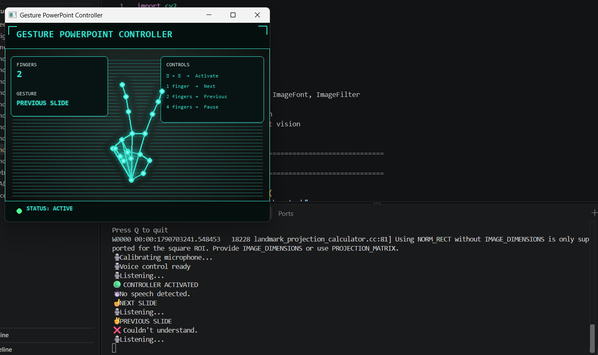
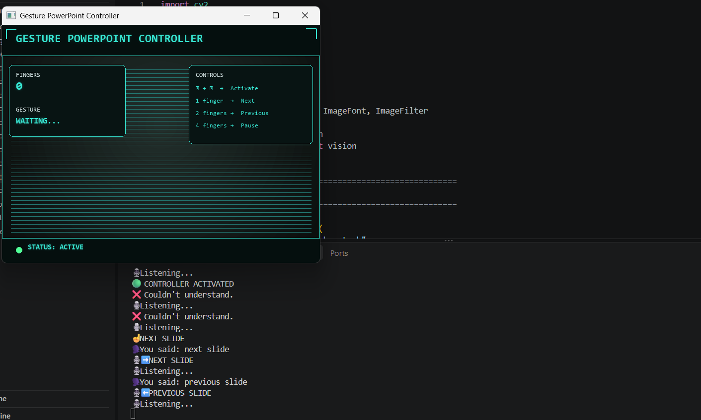

# Gesture PowerPoint Controller

A hands-free PowerPoint presentation controller that combines real-time hand gesture recognition with voice commands for controlling slides.

## Overview

The Gesture PowerPoint Controller uses a webcam to detect hand gestures and converts recognized gestures into keyboard commands for PowerPoint. A voice-control layer provides additional presentation commands.

The system also includes a custom HUD interface and an activation gesture to prevent accidental slide control when the system is not in use.

## Features

- Real-time hand gesture recognition
- Hands-free PowerPoint slide navigation
- Voice-controlled presentation commands
- Two-hand activation/deactivation gesture
- Custom futuristic HUD interface
- Keyboard automation using PyAutoGUI
- Webcam-based interaction without requiring physical controllers

## Gesture Controls

| Gesture | Action |
|---|---|
| 1 finger | Next slide |
| 2 fingers | Previous slide |
| 4 fingers | Pause / Resume |
| Two-hand pinch followed by separation | Activate / Deactivate controller |

## Voice Controls

| Voice Command | Action |
|---|---|
| "next slide" | Next slide |
| "previous slide" | Previous slide |
| "resume" | Resume presentation |
| "exit" | Stop voice control |

## How It Works

```text
Webcam
   ↓
OpenCV
   ↓
MediaPipe Hand Landmark Detection
   ↓
Gesture Recognition
   ↓
PyAutoGUI
   ↓
PowerPoint Keyboard Control

Voice control operates alongside the gesture system:

Microphone
   ↓
SpeechRecognition / PyAudio
   ↓
Voice Command Detection
   ↓
PyAutoGUI
   ↓
PowerPoint Control

## Technologies Used

Python
OpenCV
MediaPipe
PyAutoGUI
SpeechRecognition
PyAudio
Pillow (PIL)
Microsoft PowerPoint

## Project Structure

Gesture-PowerPoint-Controller/
│
├── hand_tracking_voice.py
├── hand_tracking_final.py
├── voice_test.py
├── hand_landmarker.task
├── README.md
└── .gitignore

## Installation

Install the required Python packages:

pip install opencv-python mediapipe pyautogui pillow SpeechRecognition PyAudio

## How to Run

Open the project folder in a terminal and run:

python hand_tracking_voice.py

After starting the application:

Open your PowerPoint presentation.
Start the PowerPoint Slide Show.
Perform the two-hand activation gesture.
Use hand gestures or voice commands to control the presentation.
Use the exit voice command to stop voice control.

## Screenshots

### HUD Interface


### Gesture Detection



### PowerPoint & Voice Control



## Results

The system was tested with a real PowerPoint presentation and successfully performed:
Next slide using hand gestures
Previous slide using hand gestures
Pause/resume using hand gestures
Next slide using voice
Previous slide using voice
Resume using voice
Voice-controlled exit

## Limitations

Voice recognition depends on microphone quality and speech clarity.
Speech recognition may occasionally fail to understand a command.
Gesture detection depends on camera positioning and visibility of the hands.
The controller requires a webcam and microphone.

## Future Scope

Additional presentation commands
Improved voice recognition
More gesture customization
Support for additional presentation software
Advanced presentation assistance features

## Author

MANIKUZHALI DEVAKUMAR
Electronics and Communication Engineering Student
